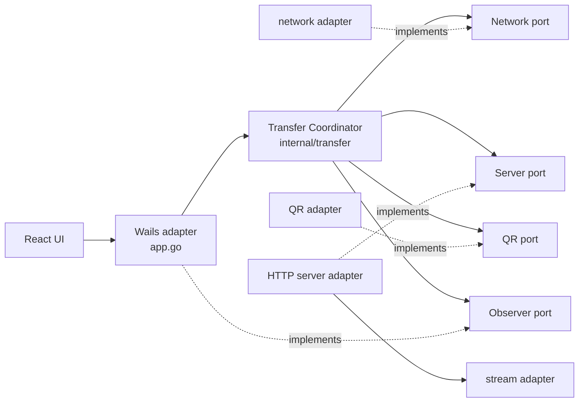
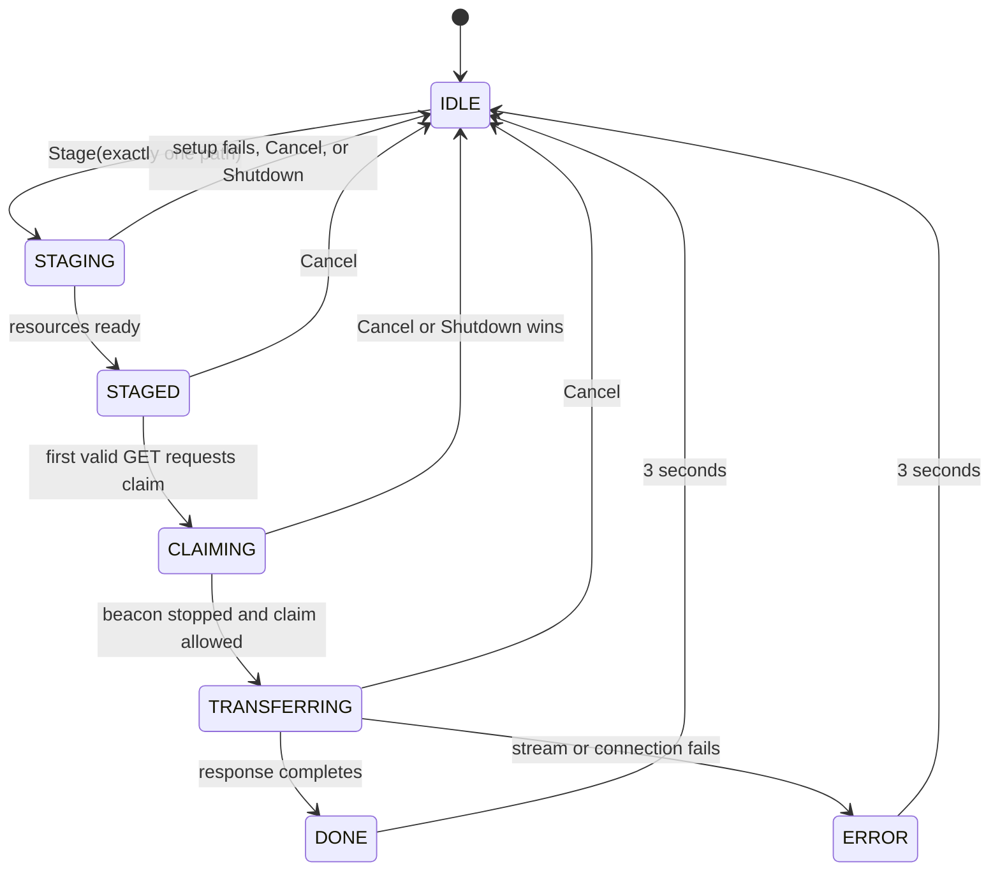
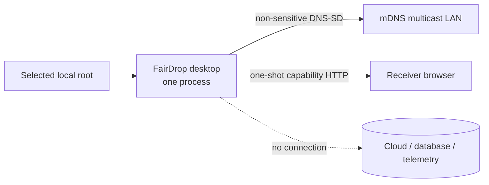

# Architecture Spine — FairDrop

## Design Paradigm

Ports and adapters around `internal/transfer.Coordinator`. The coordinator owns the use case and state; Wails, HTTP, mDNS, filesystem streaming, QR encoding, and time are adapters.



## Invariants & Rules

### AD-1 — Dependency direction and contract ownership

- **Binds:** all packages and Phase 1 contracts
- **Prevents:** Wails, HTTP, discovery, and streaming concerns becoming mutually dependent or accumulating in `app.go`
- **Rule:** `main.go` composes adapters; `app.go` translates Wails calls/events only; `internal/transfer` contains the coordinator and consumer-owned network/server ports. `internal/server` consumes the streaming port. Adapters may depend inward on contracts; the coordinator imports no Wails API and no concrete adapter. The provider-owned Phase 1 interfaces are compile-only transitional scaffolding: replace each before its first implementation and do not retain duplicate public interfaces.

### AD-2 — One owner serializes transfer state

- **Binds:** FR8-FR14, shutdown, retries, timers
- **Prevents:** double starts, stale callbacks, re-entrant deadlocks, and old sessions mutating new ones
- **Rule:** only the coordinator mutates lifecycle state. A mutex guards state and current immutable session identity; no external port is called while locked. After every unlocked external Stage or claim step, reacquire the mutex and revalidate session ID, expected state, cancellation, and shutdown before continuing or committing. The mutex-protected STAGED and TRANSFERRING commits are linearization points. The operation lease remains held through the synchronous `started` publication after a TRANSFERRING commit, so a later Cancel can publish reset only after started. Every callback and timer carries a session ID and is ignored unless it matches the current session.



### AD-3 — One process, one session, one selected root

- **Binds:** FR1, FR12, FR18, application startup
- **Prevents:** silent path truncation, ambiguous multi-root archives, and parallel processes bypassing the lifecycle
- **Rule:** v1 stages exactly one regular file or one directory. The Wails drop adapter receives `[]string`, rejects zero or multiple paths with a typed safe error, and forwards one string; it never silently selects the first. Only `IDLE` accepts Stage. Setup failure or Cancel/Shutdown during `STAGING` unwinds to IDLE, returns a command error, and emits no lifecycle event. Wails single-instance locking must be added and pinned in `main_test.go`; `OnSecondInstanceLaunch` uses `WindowUnminimise`/`WindowShow` to restore the existing window.

### AD-4 — Session-scoped transactional resource ownership

- **Binds:** FR3, FR5, FR11, FR13-FR14, NFR3, NFR8
- **Prevents:** orphan listeners, beacons, timers, goroutines, and double-close failures
- **Rule:** `App.ctx` remains the application-lifetime Wails runtime context. The coordinator derives a fresh cancellable child context per Stage; a live session owns that context/cancel, random session ID, distinct capability token, listener, beacon, and immutable staged metadata. A single per-session operation lease alone calls adapter Start/Stop/unwind; Cancel/Shutdown cancels then joins that cleanup. Setup unwinds in reverse on failure. The synchronous claim gate stops the beacon before authorization, events, headers, or bytes. Stop force-closes and is quiescent on every return, including error. DONE/ERROR retain only a terminal UI lease and generation-checked reset timer derived from application lifetime; Shutdown cancels it.

### AD-5 — Single-use capability HTTP protocol

- **Binds:** FR3, FR6-FR7, FR11-FR13, NFR4-NFR6
- **Prevents:** blind port scans claiming a transfer, dual receivers, filename injection, and unbounded HTTP resource use
- **Rule:** bind `0.0.0.0:0`; the coordinator generates a session ID and a separate capability token, each from at least 128 random bits through an injectable `crypto/rand`-backed source, then passes the token to the server. Register the methodless Go `http.ServeMux` path-variable pattern defined verbatim by AD-12 and explicitly require `request.Method == http.MethodGet` in the handler; a method-qualified pattern would return `405` and route `HEAD` to `GET`, violating the disguise rule. The first exact-token GET reserves locally, then synchronously asks the coordinator to authorize; no payload is opened and no header/event is emitted until authorization stops the beacon and commits TRANSFERRING. Wrong methods/routes/tokens are 404 without claiming; another exact-token GET is 423 only while the first listener is live; terminal teardown closes the listener. Apply safe attachment `Content-Disposition`, `Cache-Control: no-store`, `Access-Control-Allow-Origin: *`, `X-Content-Type-Options: nosniff`, and `Content-Length` for regular files only; bound header/read-idle limits and set no whole-transfer write deadline.

### AD-6 — Stream payloads without persistence

- **Binds:** FR6-FR7, NFR1-NFR2, NFR5, NFR8-NFR9, NFR11
- **Prevents:** payload-sized memory, temporary archives, zip traversal, symlink escape, corrupt central directories, and cancellation leaks
- **Rule:** regular files use context-aware bounded-buffer copying. Directories use `io.Pipe`; close `zip.Writer` before the pipe writer. Reject symlinks and non-regular entries, normalize relative ZIP names beneath one root, and revalidate during streaming. Treat spaces, Unicode, Windows long paths, and UNC paths as supported wherever native Go filesystem APIs permit—never shell-interpolate or destructively normalize them—and return typed path errors otherwise. A post-header failure reports ERROR then aborts via `http.ErrAbortHandler`.

### AD-7 — Honest, wire-level progress

- **Binds:** FR9, FR17, NFR7
- **Prevents:** NaN JSON, fabricated directory percentages, excessive UI events, and source-byte/wire-byte ambiguity
- **Rule:** count only bytes successfully written to the response and throttle to at most 4 Hz, plus a terminal snapshot when required by AD-8. `percent` is finite and clamped to `[0,100]`: for a known positive total it is `100*bytesSent/totalBytes`, while unknown and known-empty totals use zero. Add `totalKnown`; directory streams use `false/0/0`, while known zero-byte files use `true/0/0`. Speed is a rolling wire-byte rate and unknown totals render indeterminately.

### AD-8 — Backend-authoritative, session-scoped UI events

- **Binds:** FR4, FR8-FR10, FR14-FR17
- **Prevents:** optimistic frontend drift and late events corrupting the next transfer view
- **Rule:** preserve `StageTransfer(absolutePath string) (*FileMetadata, error)` and `CancelTransfer() error`; metadata JSON includes `sessionId`, `name`, `size`, `isDir`, `url`, `qrBase64`, and `warnings`. Stage success initializes the reducer's session; a pre-acknowledgement failure/cancel returns only the command error and emits nothing. One coordinator emission lane publishes FIFO with first `seq=1` and increments by one per published event. Complete always emits authoritative final progress before complete; Failed emits final progress only if bytes were written, so Prepare failure may be `started -> error`; Cancel after claim terminates any delivered `started, progress*` prefix with reset and no terminal event. Pre-claim post-Stage Cancel emits reset only. No progress follows terminal acceptance. Only the Wails adapter maps these notifications to `transfer-*`; React ignores mismatched session IDs and non-increasing sequence numbers.

### AD-9 — Explicit trusted-LAN privacy envelope

- **Binds:** FR4-FR5, NFR2-NFR6
- **Prevents:** accidental claims of transport confidentiality and unnecessary metadata disclosure
- **Rule:** v1 uses plain HTTP and documents the trusted-LAN assumption. `_fairdrop._tcp` is the fixed service type; instance names are unique per host/process without persistence. Candidate addresses must be up, broadcast-capable, non-loopback, non-point-to-point IPv4 and exclude names containing `docker`, `veth`, or `tun` before deterministic ranking. Beacon Start failure is a non-fatal Stage warning when HTTP/QR are ready; Stop guarantees the advertisement is gone on every return. The token appears only in the local Stage URL/QR and receiver request path; the selected basename appears in local metadata and authorized `Content-Disposition`; neither appears in mDNS, diagnostics, or unrelated HTTP errors, and source paths stay local. No database, settings, telemetry, persistent logs, or cloud service exists.

### AD-10 — Stable stack and native release verification

- **Binds:** all phases, NFR10
- **Prevents:** pre-GA framework migration, stale dependency guidance, non-reproducible installs, and invalid cross-platform release claims
- **Rule:** retain stable Wails v2 and lock Go/npm dependencies. Pin Node 24 LTS in development/CI, use `npm ci` with the committed lockfile and `moduleResolution: "Bundler"`; production-style `npm ci --omit=dev` is unsupported because TypeScript/Vite are build tools and are not shipped. Use `hashicorp/mdns` v1.0.7 and explicitly supersede the source spec's inactive `skip2/go-qrcode` with `boombuler/barcode` v1.1.0. Verify with Go tests/vet, frontend tests/build, and Wails build; run `go test -race` on a cgo-capable native CI runner. Build releases on native Windows/macOS runners; UPX is opt-in.

### AD-11 — Proven and accessible Wails input boundary

- **Binds:** FR1, FR15, FR18, UX-DR1, UX-DR5
- **Prevents:** regression to DOM file paths, listener leaks, inaccessible drag-only staging, and unannounced state changes
- **Rule:** preserve `DragAndDrop: &options.DragAndDrop{EnableFileDrop: true}`, `OnFileDrop(callback, true)`, `OnFileDropOff()` cleanup, and inherited CSS `--wails-drop-target: drop`. Add Wails-bound `SelectFile()` and `SelectDirectory()` commands using native runtime dialogs; every drag action has a semantic keyboard-reachable equivalent, visible focus, and `aria-live` lifecycle announcements. Keep standard OS chrome, normal start state, and lifecycle hooks pinned in `main_test.go`.

### AD-12 — Canonical cross-boundary protocol

- **Binds:** Phases 2-6 and all adapter seams
- **Prevents:** independently compliant packages choosing incompatible value types, callback models, error codes, lifecycle ordering, or shutdown postconditions
- **Rule:** `docs/fairdrop-contracts.md` is binding. It owns the canonical session/item/metadata/progress/event/error shapes, consumer-owned port signatures, command/state table, synchronous claim handshake, queued terminal-signal model, HTTP matrix, source-mutation policy, and readiness/quiescence guarantees. Phase specs may narrow but may not fork these types or semantics without an architecture update.

## Consistency Conventions

| Concern | Convention |
| --- | --- |
| Packages and interfaces | Lowercase package nouns; interfaces live with their consumer; constructors return concrete adapters; `main.go` is the composition root. |
| Session identity | Fresh cryptographically random ID per Stage; internal callbacks and UI payloads always carry it. |
| Errors | Wrap causes with `%w`; expose typed stable codes plus safe user messages; never expose absolute paths over HTTP or mDNS. |
| Cancellation | First parameter is `context.Context`; cancellation is not logged as a transfer failure; Stop is idempotent. |
| JSON/events | lowerCamelCase fields; event names are `transfer-*`; unknown numeric values use an explicit discriminator, never NaN/Inf. |
| Time | Durations are `time.Duration`; progress cadence and reset timers use injected clocks in coordinator tests. |
| Persistence | No app data writes. Build artifacts and developer console output are not runtime product state. |
| Frontend build | `npm ci` installs build/test tools; `npm ci --omit=dev` is unsupported. Both TypeScript projects use `moduleResolution: "Bundler"` absent a documented verified exception. |

## Stack

Verified against the working tree, local module metadata, lockfile, and upstream releases on 2026-08-22.

| Name | Version |
| --- | --- |
| Go module floor | 1.25.0 |
| Verified Go toolchain | 1.26.7 |
| Wails | 2.15.0 |
| React / React DOM | 19.2.8 |
| TypeScript | 5.9.3 |
| Vite | 7.3.6 |
| Tailwind CSS | 4.3.3 |
| Framer Motion | 13.1.1 |
| Vitest | 4.1.11 |
| Node.js | 24.19.0 LTS (planned pin) |
| hashicorp/mdns | 1.0.7 (planned) |
| boombuler/barcode | 1.1.0 (planned) |

## Structural Seed

```text
internal/
  transfer/   # coordinator, state, session, lifecycle ports, domain errors/events
  network/    # LAN address and mDNS adapter
  server/     # one-shot HTTP adapter and progress writer
  stream/     # file and directory streaming adapter
  qrcode/     # in-memory PNG adapter
app.go        # Wails command/event adapter
main.go       # construction and process lifecycle
frontend/src/
  components/ # DropZone, StagedView, TransferView
  transfer/   # reducer, event bindings, frontend transfer types
```



## Capability → Architecture Map

| Capability / Area | Lives in | Governed by |
| --- | --- | --- |
| FR1, FR4, FR14-FR18 — commands and UI | `app.go`, `frontend/src/transfer`, components | AD-3, AD-7, AD-8, AD-11 |
| FR2, FR5 — LAN identity and discovery | `internal/network` | AD-4, AD-9 |
| FR3, FR8-FR13 — server and lifecycle | `internal/transfer`, `internal/server` | AD-2, AD-4, AD-5, AD-8 |
| FR6-FR7 — payload delivery | `internal/server`, `internal/stream` | AD-5, AD-6 |
| NFR1-NFR9 — bounded ephemeral runtime | coordinator and adapters | AD-4-AD-7, AD-9 |
| NFR10 — release platforms | CI/release workflow, `build/` | AD-10 |
| NFR11 — path edge cases | `internal/transfer`, `internal/stream` | AD-3, AD-6 |

## Deferred

- Multi-item staging: revisit only with an explicit archive naming, collision, metadata, and UX contract.
- Authenticated discovery or TLS: revisit if FairDrop expands beyond explicitly trusted LANs or adds a native receiver.
- IPv6 and multi-homed interface selection UI: keep Phase 2 selection deterministic; add UI only after observed failures.
- ZIP compression policy and buffer size: benchmark in Phase 3; preserve AD-6 regardless of tuning.
- Linux packaging, installers, code signing, notarization, and auto-update: decide in release work, not transfer implementation.
- Persistent preferences, transfer history, resumable/ranged downloads, and multi-receiver transfers remain outside the zero-state product.
